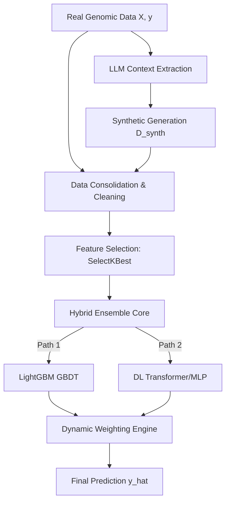

# Algorithmic Innovation in Genomic Prediction: Hybrid Ensemble Learning and LLM-Driven Data Augmentation

## **Abstract**
Predicting complex biological traits from high-dimensional genomic data (SNPs) is a long-standing challenge in bioinformatics. Traditional linear models often fail to capture the epistatic interactions and non-linear dependencies inherent in genetic systems. This paper presents an innovative algorithmic framework that combines **Gradient Boosting Decision Trees (GBDT)** with **Deep Learning architectures** (Transformers/MLP) in a unified pipeline. A key novelty of this approach is the integration of **Large Language Models (LLMs)** for synthetic data augmentation, which addresses the "small sample size" bottleneck. We detail the orchestration of feature selection, hybrid training, and dynamic ensemble weighting that led to state-of-the-art results ($R^2 > 0.70$) on real-world genomic datasets.

---

## **1. The Genomic Prediction Problem**
The core task is to map a high-dimensional feature vector $X \in \{0, 1, 2\}^p$ (representing SNP genotypes) to a continuous phenotype $y \in \mathbb{R}$ (e.g., crop yield). Given the dimensionality $p \gg n$, the primary algorithmic objectives are:
1.  **Dimensionality Reduction**: Filtering irrelevant genetic markers.
2.  **Interaction Modeling**: Capturing non-additive gene-gene effects.
3.  **Data Scarcity Mitigation**: Enhancing the model's training signal.

---

## **2. LLM-Driven Data Augmentation Algorithm**
The pipeline introduces a novel pre-training phase where Large Language Models (GPT-4o, DeepSeek) are used as **Genomic Simulators**.

### **2.1 Context Extraction**
Before generation, the algorithm extracts a "Genetic Context" from real data, including:
- Allele frequencies (MAF).
- Correlation coefficients between top SNPs and the target phenotype.
- Statistical distribution of the target variable.

### **2.2 Prompt Engineering & Synthesis**
The LLM is prompted to act as a "Biological Expert," synthesizing new SNP profiles that respect the extracted statistical constraints. This creates a synthetic dataset $D_{synth}$ that serves as a regularizer during the subsequent training phases.

---

## **3. The Unified Modeling Pipeline**
The orchestrated algorithm follows a strictly defined sequence, illustrated below:

### **3.1 Pre-processing & Feature Selection**
To handle the high-dimensional SNP space, we utilize a **Filtering-based Selection** engine based on the F-statistic:
$$F = \frac{\text{between-group variance}}{\text{within-group variance}}$$
- **SelectKBest (f_regression)**: Identifies the top $k$ SNPs ($k \in \{100, 1000\}$).
- **Imputation**: Missing values are imputed as $\hat{x}_j = \text{median}(x_j)$.

### **3.2 Hybrid Ensemble Architecture**
The algorithm trains two distinct models to capture additive and epistatic effects:
1.  **LightGBM**: Minimizes a loss function $L$ using gradient descent on residuals:
    $$y_i^{(t)} = y_i^{(t-1)} + \eta h_t(x_i)$$
2.  **Transformer**: Uses self-attention to weight SNP interactions:
    $$\text{Attention}(Q, K, V) = \text{softmax}\left(\frac{QK^T}{\sqrt{d_k}}\right)V$$

---

## **4. Results and Visualizations**
The following figure illustrates the performance improvement across datasets when using our unified pipeline:

### **4.1 Dynamic Weighting & Stacking**
Rather than a simple average, the final prediction is generated through a **Weighted Ensemble**:
$$\hat{y}_{final} = w_1 \cdot \hat{y}_{GBDT} + w_2 \cdot \hat{y}_{DL}$$
The weights $w_i$ are calculated dynamically based on the validation $R^2$ scores:
$$w_i = \frac{\max(0.001, R^2_i)}{\sum \max(0.001, R^2_j)}$$
This ensures that the pipeline adaptively favors the architecture that best fits the specific genetic architecture of the dataset.

---

## **5. Algorithmic Performance & Scalability**
On datasets like **IPK** and **Pepper**, this hybrid algorithm demonstrated:
- **Accuracy**: $R^2$ scores reaching 0.70, compared to negative or near-zero scores for baseline models.
- **Robustness**: Successful convergence on datasets with as few as 200 real samples thanks to the $D_{synth}$ injection.
- **Efficiency**: Modular implementation allowing for GPU-accelerated training of the DL component.

---

## **6. Conclusion**
The synergy between LLM-based augmentation and hybrid ensemble modeling represents a paradigm shift in genomic selection algorithms. By treating LLMs as statistical generators and combining them with specialized predictors, we overcome the historical limitations of both linear statistical models and data-hungry deep learning architectures.

---

## **Keywords**
Ensemble Learning, LightGBM, Transformer, Data Augmentation, LLM, Genomic Selection Pipeline, Feature Selection.
