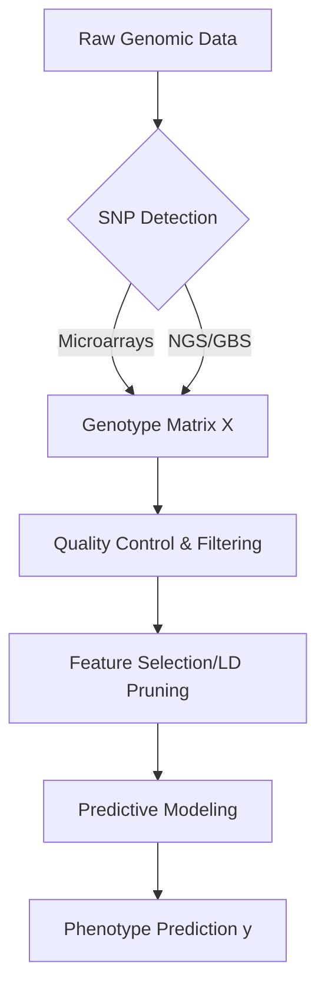

# Single Nucleotide Polymorphisms (SNPs) in Genomic Prediction: A Comprehensive Survey of Background, Technologies, and Modern Machine Learning Approaches

## **Abstract**
Single Nucleotide Polymorphisms (SNPs) are the most frequent form of genetic variation, serving as the fundamental unit of inheritance in modern genomics. The rapid evolution of high-throughput genotyping has positioned SNPs as the cornerstone of Genome-Wide Association Studies (GWAS) and Genomic Selection (GS). This survey provides a deep dive into the biological nature of SNPs, the technologies used for their detection, and the paradigm shift from traditional statistical methods to advanced Machine Learning (ML) and Deep Learning (DL) architectures. Furthermore, we explore the emerging role of Large Language Models (LLMs) in data augmentation for SNP-phenotype mapping.

---

## **1. Introduction**
Genomic variation is the driver of phenotypic diversity in all living organisms. Among various types of genetic markers—such as microsatellites (SSRs) and Indels—**Single Nucleotide Polymorphisms (SNPs)** have emerged as the most powerful markers due to their abundance and stability. A SNP occurs when a single nucleotide (A, T, C, or G) in the genome differs between members of a biological species or paired chromosomes.

In agricultural science, SNPs are used to predict complex traits like crop yield, disease resistance, and environmental adaptation. In medicine, they are pivotal for understanding hereditary diseases and personalizing drug responses.

---

## **2. Biological Fundamentals of SNPs**
### **2.1 Origin and Frequency**
SNPs arise from point mutations that are preserved through generations. To be classified as a SNP, the variation must be present in at least 1% of the population. They occur approximately every 100 to 300 base pairs in most genomes, providing a high-resolution map of genetic inheritance.

### **2.2 Biallelic Nature**
Most SNPs are biallelic, meaning they exist in only two possible states (e.g., Cytosine or Thymine). This binary property is computationally advantageous, allowing for efficient digital encoding:
- **0**: Homozygous for the Reference allele ($AA$)
- **1**: Heterozygous ($Aa$)
- **2**: Homozygous for the Alternative allele ($aa$)

Mathematically, the genotype of individual $i$ at SNP $j$ can be represented as $x_{ij} \in \{0, 1, 2\}$.

### **2.3 Linkage Disequilibrium (LD)**
SNPs are not independent; they are often inherited together in blocks called haplotypes. This correlation, known as **Linkage Disequilibrium (LD)**, is often measured by the $r^2$ statistic:
$$r^2 = \frac{D^2}{P_A P_a P_B P_b}$$
where $D$ is the coefficient of linkage disequilibrium. This allows researchers to use a subset of "tag SNPs" to represent a larger genomic region, significantly reducing the dimensionality of the data without losing critical information.

---

## **3. Architecture Overview**
Below is a conceptual diagram of how SNP data flows through a modern predictive pipeline:

---

## **4. Genotyping Technologies**
The shift from discovery to massive application was enabled by two main technologies:
- **SNP Arrays (Microarrays)**: Pre-designed chips containing probes for thousands of known SNP sites. They are highly accurate and cost-effective for established species (e.g., 50K or 600K SNP chips).
- **Next-Generation Sequencing (NGS)**: Methods like **Genotyping-by-Sequencing (GBS)** allow for the discovery of *de novo* SNPs and are essential for species with limited genomic resources.

---

## **4. Genomic Selection (GS): From Statistics to AI**
### **4.1 The $p \gg n$ Challenge**
A major hurdle in genomic prediction is the high dimensionality: we often have hundreds of thousands of SNPs ($p$) but only a few hundred or thousand individuals ($n$). This leads to overfitting in traditional models.

### **4.2 Traditional Statistical Methods**
- **GBLUP (Genomic Best Linear Unbiased Prediction)**: Uses a genomic relationship matrix to estimate breeding values.
- **Bayesian Approaches (BayesA, BayesB)**: Allow for different SNPs to have different effect sizes, better modeling major gene effects.

---

## **5. Modern Machine Learning & Deep Learning**
### **5.1 Gradient Boosting (XGBoost & LightGBM)**
Tree-based models have become the state-of-the-art for tabular SNP data. They excel at capturing non-linear interactions and are robust to high-dimensional feature spaces.

### **5.2 Deep Learning Architectures**
- **Convolutional Neural Networks (CNNs)**: Treat the genome as a 1D signal to identify "genomic motifs"—local patterns of SNPs that influence traits.
- **Transformers**: Utilize self-attention mechanisms to model long-range dependencies across chromosomes, capturing epistatic interactions (gene-gene interactions) that linear models miss.

---

## **6. The Frontier: LLM-Based Data Augmentation**
A significant recent innovation involves using **Large Language Models (LLMs)** like GPT-4, DeepSeek, or Kimi to generate synthetic SNP-phenotype pairs. By providing the LLM with statistical contexts (e.g., allele frequencies and trait correlations), researchers can augment small datasets, allowing deep learning models to converge more effectively.

---

## **7. Conclusion**
SNPs remain the most reliable and scalable genetic markers. As we move towards "Genomics 2.0," the integration of high-resolution SNP mapping with hybrid AI architectures (Ensembles of LightGBM and Transformers) promises to revolutionize our ability to predict complex biological outcomes, from the yield of a pepper plant to human disease susceptibility.

---

## **Keywords**
SNP, Genomic Selection, Machine Learning, Deep Learning, Linkage Disequilibrium, Transformer, Data Augmentation.
